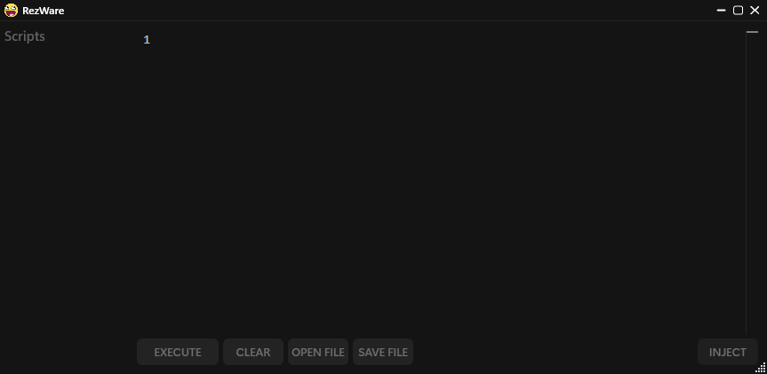

> [!WARNING]
> You are most likely going to be banned since this is detected by Byfron. Use an alt account while running RezWare. Use the repository to understand what's happening and how it works.
> I am not liable for any bans

# RezWare
An executor made for the web version | RobloxPlayer of Roblox.

### Socials
https://discord.gg/rezware

## Features
- Fast execution
- Multi-instance compatibility
- Supports executing most scripts including Lua Armor scripts
- Uses extremely fast virtual filesystem that syncs to the external
- No in-game performance change & no high CPU usage

### Preview

This is the UI of the version v1.7c:

The Current UNC is ~88%

## Credits: .Rizve, Glosary, danlacho

Based on Xeno Orginal Repo of Xeno https://github.com/Riz-ve/Xeno/

## Note
Big Thanks who helped me with RezWare Thanks .Rizve for injection system. Glosary helped make init!
