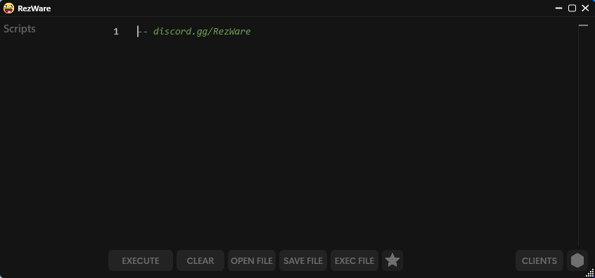

> [!WARNING]
> RezWare may be detected by Byfron, which increases the likelihood of account bans.
It is highly recommended to use an alt account when running RezWare.
Please review the repository for detailed insights into how it operates.
Disclaimer: I am not liable for any bans.

# RezWare
An executor made for the web version | RobloxPlayer of Roblox.

### 🌐 Socials
  
  
## ✨ Features
- Fast Execution: Execute scripts with incredible speed.
- Multi-Instance Compatibility: Run multiple instances simultaneously.
- Support for Lua Armor Scripts: Compatible with most scripts, including Lua Armor.
- Efficient Virtual Filesystem: Synchronizes with the external environment, ensuring smooth performance.
- Optimized Performance: No in-game lag or high CPU usage.

### 📸 Preview

This is the UI of the version (v1.7c):

The Current UNC is ~88%

## 📜 Credits

- .Rizve: Developed the injection system.
- danlacho: Contributed to the project.
- Glosary: Assisted with initialization.
- h0ndra: Helped make sUnc, Unc

## 💡 Note

- .Rizve for the injection system.
- Glosary for helping with initialization, Fixing bugs.

------------------------------------------------------------

This project is based on the Xeno Original Repository by Xeno.
Check it out here: [GitHub - Xeno Repo](https://github.com/Riz-ve/Xeno/)
